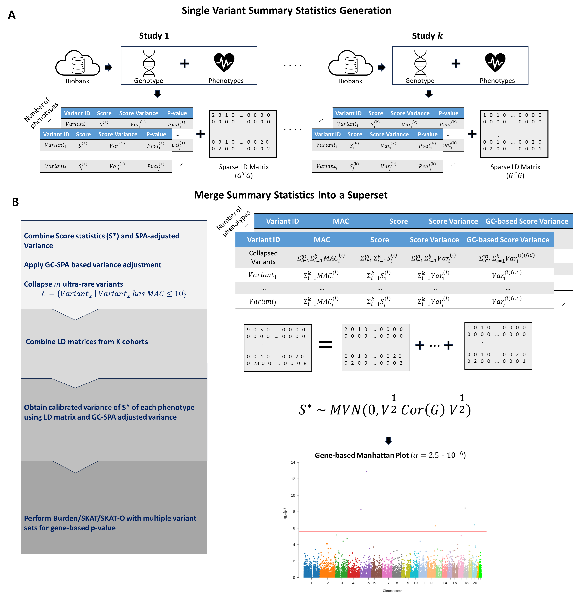

# Meta-SAIGE for Rare Variant Meta-Analysis

## Description
Meta-SAIGE is a meta-analysis tool for rare variant association studies. It is designed to combine the results of multiple cohorts and perform a meta-analysis. Meta-SAIGE is built on top of SAIGE/SAIGE-GENE+ and can be used to perform meta-analysis on the summary statistics of SAIGE and LD matrix from SAIGE-GENE+.

## Workflow Overview



## Dependencies (built with R3.6.3)
- `SAIGE (v.1.3.2)` (for summary statistics and LD matrix generation only)
- `argparser`
- `data.table`
- `dplyr`
- `SKAT`
- `SPAtest`
- `Matrix`

## Input Files

- `GWAS summary` : can be obtained from [SAIGE](https://saigegit.github.io/SAIGE-doc/docs/single.html)
- `LD matrix` : can be obtained from [SAIGE-GENE+](https://saigegit.github.io/SAIGE-doc/docs/set.html)
<br>
LD matrix could be generated by running the following command in SAIGE-GENE+:

```
step3_LDmat.R \
    --bedFile=${plink_file_prefix}.bed \ #For example, if the plink file is called "example", then the bed file is "example.bed"\
    --bimFile=${plink_file_prefix}.bim \ #For example, if the plink file is called "example", then the bim file is "example.bim"\
    --famFile=${plink_file_prefix}.fam \ #For example, if the plink file is called "example", then the fam file is "example.fam"\
    --AlleleOrder=alt_first \ # or ref_first\
    --SAIGEOutputFile=${SAIGE_output_file} \ #The output directory\
    --chrom=${chromosome_number} \  #The chromosome number \
    --groupFile=${group_file} \ #Group file for gene-based analysis. example provided in extdata/test_input/groupfiles\
    --annotation_in_groupTest=${annotation_file} \ #Functional annotation for the variants of interest. ex. 'missense;lof', 'synonymous;lof'\
    --maxMAF_in_groupTest=0.01 \ #Maximum MAF for group-based analysis ex. 0.01 0.001 0.0001
```


## CLI Usage

### GC-based Method
- `--num_cohorts` : number of cohorts
- `--chr` : chrmosome number
- `--col_co` : ultra-rare variant collapsing cut-off. (default is 10)
- `--info_file_path` : path to the marker_info.txt file generated from SAIGE 'step3_LDmat.R'. Need to specify marker_info.txt file from each and every cohort delimited by white-space (`' '`)
- `--gene_file_prefix` : prefix to the LD matrix separated by genes (also generated from SAIGE `step3_LDmat.R`) usually same as marker_info.txt file's prefix
- `--gwas_path` : path to the GWAS summary. Need to specify GWAS summary file from each and every cohort delimited by white-space (`' '`)
- `--ancestry` :  Ancestry indicator (ex. 1 1 1 2). Need to specify ancestry indicator from each and every cohort delimited by white-space (`' '`). Optional input for multi-ancestry meta-analysis.
- `output_prefix`: directory for output
- `verbose`: verbose mode. TRUE or FALSE
<br>
example commands for GC-based method:
<br>

```
#!/bin/bash
cd META_SAIGE

/usr/bin/time -v Rscript R/RV_meta_GC.R \
    --num_cohorts 3 \
    --trait_type binary \
    --chr 7 \
    --col_co 10 \
    --ancestry 1 1 2 \
    --info_file_path extdata/test_input/cohort1/LD_mat/cohort1_chr_7.marker_info.txt \
    extdata/test_input/cohort2/LD_mat/cohort2_chr_7.marker_info.txt \
    extdata/test_input/cohort2/LD_mat/cohort2_chr_7.marker_info.txt \
    \
    --gene_file_prefix extdata/test_input/cohort1/LD_mat/cohort1_chr_7_ \
    extdata/test_input/cohort2/LD_mat/cohort2_chr_7_ \
    extdata/test_input/cohort2/LD_mat/cohort2_chr_7_ \
    \
    --gwas_path extdata/test_input/cohort1/GWAS_summary/t2d_cohort1_step2_res_7.txt \
    extdata/test_input/cohort2/GWAS_summary/t2d_cohort2_step2_res_7.txt \
    extdata/test_input/cohort2/GWAS_summary/t2d_cohort2_step2_res_7.txt \
    \
    --output_prefix extdata/test_output/GC_t2d_chr7_0.01_missense_lof_res.txt \
    --verbose TRUE 
```

## Rscript Usage

### Installation

```
library(remotes)
install_github('git@github.com:leelabsg/SAIGE_META.git')
library(MetaSAIGE)
```

### Loading Input Files
```
MetaSAIGE_InputObj <- Get_MetaSAIGE_Input(n.cohorts, chr, gwas_path, info_path, gene_file_prefix)
```

- `num_cohorts` : number of cohorts
- `chr` : chrmosome number
- `gwas_path` : a vector of paths to the SAIGE GWAS summary statistics file
- `info_file_path` : a vector of paths to the marker_info.txt file generated from SAIGE 'step3_LDmat.R'.
- `gene_file_prefix` : a vector of prefixes of the LD matrix files in the unit of genes (also generated from SAIGE `step3_LDmat.R`) usually same as marker_info.txt file's prefix

### Running Meta-Analysis
```
Run_MetaSAIGE(MetaSAIGE_InputObj, col_co, output_path, ancestry)
```
- `MetaSAIGE_InputObj` : input file objects generated by `Get_MetaSAIGE_Input` function
- `col_co` : ultra-rare variant collapsing cut-off. (default is 10)
- `ancestry` : ancestry indicator vector (ex. c(1, 1, 1, 2)). Need to specify ancestry indicator from each and every cohort
- `output_path` : path for the meta-analysis resutls